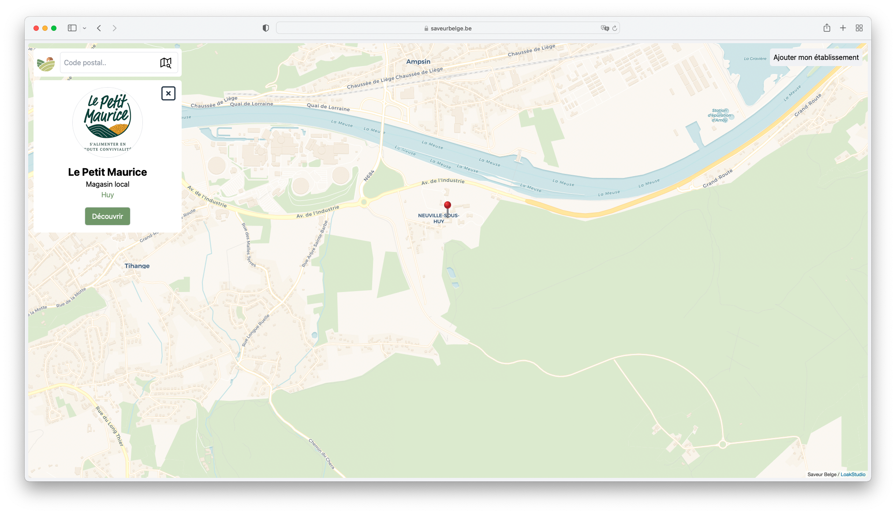
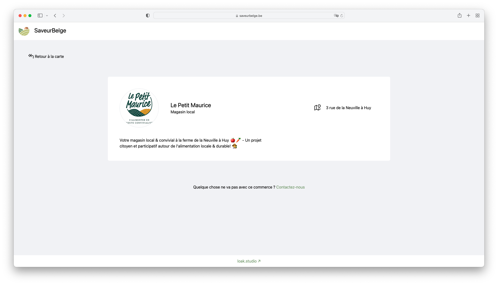

# SaveurBelge

SaveurBelge est une application web, initiallement lancée lors de la crise du COVID-19, permettant aux propriétaire de commerces/restaurants/... vendant des produits locaux d'ajouter leur établissement à une carte. Cette carte permettant aux utilisateurs de trouver des producteurs locaux près de chez eux !

## Aspects techniques

J'ai développé ce site en utilisant
- Adonis
- Unpoly
- Tailwind